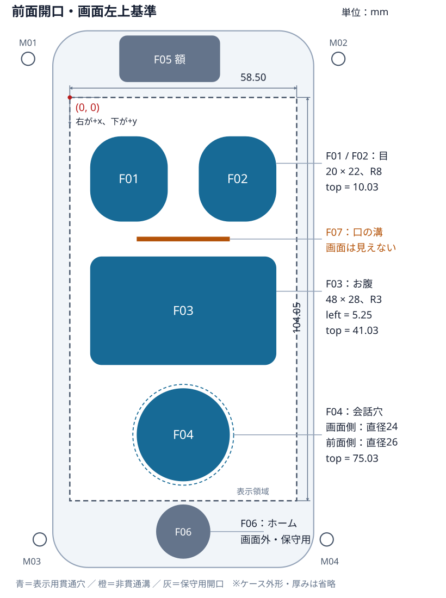

# ケースV1：開口部の寸法・配置仕様（画面左上基準）

## 1. この仕様書の対象

白PLA用ケースV1に作成した穴・溝・切り欠きの、**寸法、位置、種類、役割**をまとめる。特に、Web画面の目・メッセージ・会話ボタンを外装の穴に合わせるための基準とする。

- 編集用CAD：[phone-robot-case-v1.f3d](../cad/phone-robot-case-v1.f3d)
- 形状を定義するコード：[build_robot_case.py](../scripts/build_robot_case.py)
- 構造・組み立て・印刷：[ケースV1の設計メモ](robot-case-v1.md)
- 対象部品：`Robot V1 - A Holder and Stand`、`Robot V1 - B Front Cover`

記載値は、作成済みV1のFusionパラメータと開口スケッチをMCPで読み取り、照合した**CAD上の公称値**。印刷後の実測値ではない。以降のCAD変更に自動追従する文書ではないため、穴や参照端末の寸法を変更したら更新する。

READMEの対象はiPhone SE第2世代だが、Fusion内の参照モデル名は `iPhone SE 3 - Parametric Drawing Model`。本書はこの既存モデルを基準にしており、SE2実機、保護フィルム、印刷公差との適合は別途確認する。

## 2. 座標の定義：最重要

**原点 `(0, 0)` は、縦向きiPhoneの「実際に映像を表示できる領域」の左上。** 本体の左上、ガラスの左上、SafariのWebページ表示領域の左上ではない。

- `x`：原点から**右方向**への距離。
- `y`：原点から**下方向**への距離。
- 単位：特記のない限り **mm**。
- 左右：画面を正面から見た左右。ロボット自身から見た左右ではない。
- `left`, `top`：穴を囲む最小の軸平行長方形（外接矩形）の左上。
- `width`, `height`：その外接矩形の幅と高さ。
- `cx`, `cy`：穴の中心。円形穴でも左上位置を併記する。
- `R`：角丸の半径。直径ではない。
- 負の座標や画面サイズを超える座標：画面外に位置する。誤記ではない。

画面に正対した座標であり、机上からの投影寸法ではない。スタンドの後傾12°による補正は不要。

```text
表示領域の左上 (0, 0) ─────────→ x
          │
          │      穴の左上 (left, top)
          │             ┌───────────┐
          │             │     ●     │ ← 中心 (cx, cy)
          │             └───────────┘
          ↓ y               width
```

### 表示領域と端末外形

| 基準 | 値 |
|---|---:|
| 表示領域の幅 | 58.50 |
| 表示領域の高さ | 104.05 |
| 表示領域の右下座標 | (58.50, 104.05) |
| 本体の幅 × 高さ | 67.27 × 138.44 |
| 本体左端から表示領域左端まで | 4.385 |
| 本体上端から表示領域上端まで | 17.19 |
| この座標系での本体左上 | (-4.385, -17.19) |
| この座標系での本体右下 | (62.885, 121.25) |

## 3. 画面表示・会話操作に使う4つの穴

**Web画面を合わせる場合、まずこの表を使う。** 寸法はカバー裏面側、すなわち画面側の開口を基準とする。

| ID | 部位・役割 | 穴の種類 | left | top | width | height | cx | cy | 角R |
|---|---|---|---:|---:|---:|---:|---:|---:|---:|
| F01 | 左目：視線・まばたき・表情 | 角丸長方形の貫通穴 | 5.25 | 10.03 | 20.00 | 22.00 | 15.25 | 21.03 | 8.00 |
| F02 | 右目：視線・まばたき・表情 | 角丸長方形の貫通穴 | 33.25 | 10.03 | 20.00 | 22.00 | 43.25 | 21.03 | 8.00 |
| F03 | お腹：短いメッセージ・会話状態 | 角丸長方形の貫通穴 | 5.25 | 41.03 | 48.00 | 28.00 | 29.25 | 55.03 | 3.00 |
| F04 | 会話ボタン：指で画面に直接触れる | 円形の貫通穴、直径24.00 | 17.25 | 75.03 | 24.00 | 24.00 | 29.25 | 87.03 | — |

例：お腹の穴は、**画面左端から5.25 mm、上端から41.03 mmの位置を左上として、横48 mm・縦28 mm**。右端は53.25 mm、下端は69.03 mmになる。

角丸長方形は角が欠けるため、外接矩形の全面が見えるわけではない。文字や重要な記号は角と縁から余白を取る。

### 配置図

青色は画面を見せる穴、橙色は装飾の溝。図の色は分類用であり、実際のケースは白PLA単色。



この図は画面に正対した2D配置図で、ケースの厚み・台座は省略している。寸法の正本は表の数値とCAD。

### 穴どうしの間隔と画面端の余白

| 箇所 | 距離 |
|---|---:|
| 左目の右端〜右目の左端 | 8.00 |
| 目の上端〜画面上端 | 10.03 |
| 左目の左端〜画面左端／右目の右端〜画面右端 | 各5.25 |
| 目の下端〜お腹の上端 | 9.00 |
| お腹の左右端〜画面左右端 | 各5.25 |
| お腹の下端〜会話穴の上端（画面側） | 6.00 |
| 会話穴の下端〜画面下端（画面側） | 5.02 |

### F04：タッチ穴は入口と画面側で直径が異なる

| 箇所 | 直径 | left | top | 中心 |
|---|---:|---:|---:|---|
| 画面側・最小径 | 24.00 | 17.25 | 75.03 | (29.25, 87.03) |
| 指を入れる前面側の入口 | 26.00 | 16.25 | 74.03 | (29.25, 87.03) |

- カバー厚：2.40。
- 前面の縁に1.00 × 1.00、45°の面取り。
- 直径24の円筒部分は厚さ方向に1.40残る。
- Webボタンの見える範囲は、入口の26ではなく**画面側の24を基準**にする。
- 可動ボタンや導電部品はない。指が穴を通ってiPhoneのガラスに直接触れる。
- ガラス表面〜カバー裏面の隙間は0.40、ガラス表面〜カバー前面は2.80。

斜めから見るとカバー厚と隙間による視差がある。表は正対時の公称配置であり、縁ぎりぎりまで文字を配置しない。

## 4. その他の前面開口と装飾

こちらも同じ画面左上原点。画面外の物理部品へのアクセスや、外装自体の加工を表す。

| ID | 部位 | 種類 | left | top | width | height | cx | cy | 角R／深さ |
|---|---|---|---:|---:|---:|---:|---:|---:|---|
| F05 | 額の共用開口 | 角丸長方形の貫通穴 | 12.75 | -15.97 | 26.00 | 12.00 | 25.75 | -9.97 | R2.00 |
| F06 | ホームボタン | 円形の貫通穴、直径14.00 | 22.25 | 105.00 | 14.00 | 14.00 | 29.25 | 112.00 | — |
| F07 | 口 | 長方形の浅い溝、**非貫通** | 17.25 | 35.93 | 24.00 | 1.20 | 29.25 | 36.53 | 深さ0.60 |

- **F05**：前面カメラ、受話口、近接・照度センサーを共用開口で露出する。表示領域より上なので、ここにWebアプリの映像は出せない。画角・集音・センサー動作は実機確認が必要。
- **F06**：iPhone本体のホームボタンを操作する保守用。表示領域より下なので、**F04の会話ボタンとは別物**。
- **F07**：ロボットの口を表す外装の溝。画面上に重なる位置だが、白PLAが厚さ1.80残るため画面は見えない。現形状ではここに表示した口アニメーションは外から見えない。

F01〜F06の穴は、前カバーの厚さ2.40を貫通する。F04の前面側のみ面取りあり。

## 5. M3固定穴：両パーツ共通

前カバーとホルダーに同じ中心位置で設けた**直径3.40の貫通穴**。4本のM3ボルト＋ナットで固定するためのもので、ねじ山・皿穴・ナットの回り止めはない。

| ID | 位置（正面から見て） | left | top | width = height | cx | cy |
|---|---|---:|---:|---:|---:|---:|
| M01 | 左上（TL） | -12.45 | -11.67 | 3.40 | -10.75 | -9.97 |
| M02 | 右上（TR） | 67.55 | -11.67 | 3.40 | 69.25 | -9.97 |
| M03 | 左下（BL） | -9.45 | 112.33 | 3.40 | -7.75 | 114.03 |
| M04 | 右下（BR） | 64.55 | 112.33 | 3.40 | 66.25 | 114.03 |

- 前カバー側の穴の長さ：2.40。
- ホルダー側の穴の長さ：10.61。
- 組み立てた樹脂部分の通過長：合計13.01。ナット・ワッシャー厚は含まない。
- M3×18〜20 mmを候補として実物でねじ長さと工具アクセスを確認する。
- ねじ穴はすべて画面外。PLAへ直接ねじ込んで固定する設計ではない。

## 6. 背面の穴

**座標の左右は反転しない。** 以下は、背面の穴を前面へ透視・投影したときの位置を、同じ「画面左上基準」で表す。端末を裏返して背面から見た写真では、左右が反転して見える。

| ID | 部位・役割 | 種類 | left | top | width | height | cx | cy | 角R |
|---|---|---|---:|---:|---:|---:|---:|---:|---:|
| R01 | 背面カメラ・マイク・フラッシュの逃げ | 角丸長方形の貫通穴 | -1.75 | -11.47 | 26.00 | 18.00 | 11.25 | -2.47 | 2.00 |
| R02 | 放熱・取り外し時の指のアクセス | 角丸長方形の貫通穴 | 9.25 | 28.03 | 40.00 | 62.00 | 29.25 | 59.03 | 4.00 |

いずれもホルダー背板の厚さ2.40を貫通する。Fusionでは収納部の前側から10.61の距離を切り取っているが、この位置では収納空間があるため、**実際に穴が開く樹脂板の厚さは2.40**。

R01はカメラの突出を受け止めず逃がすための穴。R02は背面ガラスを露出する穴であり、画面表示用ではない。端末自体に穴を開ける加工ではない。

## 7. 収納部・側面・底面・台座の切り欠き

これらは四周が囲まれた窓ではなく、ポケットや外周へ開いた切り欠き。下表の幅・高さは、**Fusionで切り取りに使用したスケッチの外接矩形**である。実際の開口輪郭は部品外形や他の切り欠きとの交差で決まり、表の長方形がそのまま完成品に残るわけではない。

座標は引き続き画面左上を基準としたXYへの投影位置。Zは次節のFusion座標を使う。

| ID | 部位 | left | top | width | height | cx | cy | 種類・役割 |
|---|---|---:|---:|---:|---:|---:|---:|---|
| A01 | iPhone収納部 | -4.785 | -17.59 | 68.07 | 139.24 | 29.25 | 52.03 | 角R9.50のポケット。位置決め・保持 |
| A02 | 左側面の操作用切り欠き | -13.185 | -5.97 | 12.00 | 48.00 | -7.185 | 18.03 | 消音スイッチ・音量ボタンへのアクセス |
| A03 | 右側面の操作用切り欠き | 59.685 | -5.97 | 12.00 | 48.00 | 65.685 | 18.03 | サイドボタンへのアクセス |
| A04 | 底部の音孔・端子用切り欠き | 2.25 | 118.03 | 54.00 | 16.00 | 29.25 | 126.03 | Lightning端子と左右の音孔列を開放 |
| A05 | 台座の後方開放ケーブル溝 | 21.25 | 約112.032 | 16.00 | 90.00 | 29.25 | 約157.032 | 台座中央から後方へのケーブル逃げ |

### 深さと切り取り方向

| ID | Fusionの切り取り範囲・補足 |
|---|---|
| A01 | Z=7.71から-0.50まで、深さ8.21。上下左右の収納隙間は各0.40 |
| A02・A03 | Z=7.71から-0.50まで、深さ8.21。背板は残し、立ち上がりの側壁を切り欠く |
| A04 | Z=7.71から-2.90まで、切り取り距離10.61。背板も含めて底辺へ開放する |
| A05 | Z=4.00から-86.00まで、後方へ切り取る。X=-8〜+8。Yは約-150.002〜-60.002 |

- A04の高さ16は、外周の外まで伸ばした**切り取り用スケッチの高さ**であり、完成品に高さ16の閉じた穴があるという意味ではない。
- A05の表の高さ90とZ方向の切り取り距離90も切り取り体積の寸法であり、実際のケーブル溝の長さではない。傾斜した台座との交差で開口が決まり、台座前端のつなぎ部分は残る。
- A05はホルダー下部の背板にも交差する。このため、背板の下端にはA04とA05を合わせた段付きの切り欠きができる。
- 台座のケーブル溝は後方へ開いているため、コネクタを閉じた小穴に通す必要はない。
- ケーブル保持爪やストレインリリーフはない。実ケーブルのプラグ外形と曲げに必要な空間は別途確認する。

## 8. Fusion座標との変換

Fusionの既存モデルは本体中心がXY原点、右が+X、上が+Y。画面左上は次の位置にある。

```text
画面左上のFusion座標：X = -29.25, Y = +52.03
```

Fusion座標をmmにそろえたうえで、次の式を使う。

```text
画面左上基準へ：
  x = X + 29.25
  y = 52.03 - Y

Fusion座標へ：
  X = x - 29.25
  Y = 52.03 - y

中心から外接矩形の左上へ：
  left = cx - width / 2
  top  = cy - height / 2
```

参照画面の寸法が変わった場合の一般式：

```text
画面左端X = -SE3_ActiveWidth / 2
画面上端Y = SE3_OverallHeight / 2 - SE3_ActiveTopOffset
x = X - 画面左端X
y = 画面上端Y - Y
```

Fusion APIが返す内部長さの単位はcm。本書はmmなので、API値を使う場合は10倍する。

### 厚さ方向の基準

Zは前面に向かって増える。

| 面 | FusionのZ（mm） |
|---|---:|
| ホルダー背板の外側 | -2.90 |
| ホルダー収納部の底 | -0.50 |
| iPhone背面ガラス | 0.00 |
| iPhone前面ガラス | 7.31 |
| 前カバー裏面・ホルダーとの合わせ面 | 7.71 |
| 前カバー前面 | 10.11 |

参照モデルの表示領域には厚さ0.02の可視化用ボディがあるが、ガラス表面の寸法基準は7.31であり、その可視化ボディの上面7.33ではない。

印刷用STLは各パーツを造形姿勢へ回転・移動している。**STLビューアの座標をそのまま本書の座標と比較しない。** F3Dまたは組み立て座標を保ったSTEPを使う。

## 9. Web画面への対応

### mmをそのままCSSの長さ単位にしない

ブラウザの `mm` や `px` は、実際の画面上での物理的なmmと一致するとは限らない。`left: 5.25mm` と書くだけでは穴に合う保証はない。

本書の座標を**幅58.50・高さ104.05の仮想キャンバス**として扱い、実画面に対応する領域へ拡大する。SVGなら `viewBox="0 0 58.5 104.05"` を使うと、表の値をそのまま図形座標にできる。

配置の定義例（mm基準の設計値。CSS pxではない）：

```json
{
  "screen": { "width": 58.5, "height": 104.05 },
  "leftEye":  { "left": 5.25,  "top": 10.03, "width": 20, "height": 22, "radius": 8 },
  "rightEye": { "left": 33.25, "top": 10.03, "width": 20, "height": 22, "radius": 8 },
  "belly":    { "left": 5.25,  "top": 41.03, "width": 48, "height": 28, "radius": 3 },
  "talk":     { "left": 17.25, "top": 75.03, "width": 24, "height": 24, "radius": 12 }
}
```

### CSS pxへ変換する式

**物理的な表示領域全体に対応する**キャンバスの幅を `W`、高さを `H` CSS pxとする。これはSafariのツールバーなどを除いたページ領域を、無条件に全画面とみなしてよいという意味ではない。

```text
left_px   = left_mm   / 58.50  × W
top_px    = top_mm    / 104.05 × H
width_px  = width_mm  / 58.50  × W
height_px = height_mm / 104.05 × H
```

仮に表示領域全体と一致するキャンバスが375 × 667 CSS pxの場合：

| 部位 | left_px | top_px | width_px | height_px |
|---|---:|---:|---:|---:|
| 左目 | 33.65 | 64.30 | 128.21 | 141.03 |
| 右目 | 213.14 | 64.30 | 128.21 | 141.03 |
| お腹 | 33.65 | 263.02 | 307.69 | 179.49 |
| 会話ボタン | 110.58 | 480.97 | 153.85 | 153.85 |

この表は換算例であり、実際のSafariが必ず375 × 667のページ領域になることを保証しない。キャンバスの縦横比は表示領域と合わせ、実装では可能な限り等倍比率で拡大する。余白を入れた場合はそのオフセットも計算に含める。

### 実機合わせの注意

1. 縦向きで、展示時に使うブラウザ／ホーム画面起動の表示状態を固定する。
2. ステータスバー、Safariのバー、ページ余白・スクロール・ズームによるずれを確認する。
3. 仮想キャンバスが物理画面のどの範囲に対応するかを確認し、必要なら位置と倍率を校正する。`innerHeight`や`100vh`だけで物理画面全体を表せると仮定しない。
4. ページとして表示できない領域が穴にかかる場合は、表示方式またはCADの穴位置を見直す。
5. 前カバーを重ね、目・お腹・会話穴の輪郭テストを表示して合わせる。
6. 文字と瞳は開口の縁から内側に余白を取り、必要に応じて背景を穴より大きく描画して、収納隙間や組み立てずれを吸収する。
7. 会話ボタンのタッチ判定は、直径24の見える円を十分に含む範囲にする。画面側に物理ボタンを押し返す機構はない。

## 10. 変更箇所とFusionの対応

表のIDは本書用の識別子。Fusionでは下表のスケッチ・フィーチャー名を参照する。`RB_`パラメータを変更した場合、画面左上基準の数値も再計算する。

| ID | Fusionの対応箇所 | 主な変更項目 |
|---|---|---|
| F01・F02 | `B03 Left eye - EDIT` / `B03 Right eye - EDIT` | `RB_EyeWidth`, `RB_EyeHeight`, `RB_EyeRadius`, `RB_EyeX`, `RB_EyeY` |
| F03 | `B04 Message window - EDIT` | `RB_BellyWidth`, `RB_BellyHeight`, `RB_BellyRadius`, `RB_BellyY` |
| F04 | `B05 Talk button - EDIT` / `B06 Touch entry bevel - EDIT` | `RB_TalkDiameter`, `RB_TalkY`, `RB_TouchBevel` |
| F05 | `B07 Forehead optics and receiver` | `RB_ForeheadWidth`, `RB_ForeheadHeight`, `RB_ForeheadX`, `RB_ForeheadY`。角Rはスケッチ寸法 |
| F06 | `B08 Home maintenance access` | `RB_HomeDiameter`。中心Yは参照端末のホームボタン位置に連動 |
| F07 | `B09 Decorative mouth` / `B09 Shallow mouth groove` | `RB_MouthWidth`, `RB_MouthHeight`, `RB_MouthY`, `RB_MouthDepth` |
| M01〜M04 | 両パーツの `A20` / `B20`、`TL` / `TR` / `BL` / `BR`付きの穴 | `RB_ScrewDiameter`, `RB_TopScrewX`, `RB_TopScrewY`, `RB_BottomScrewX`, `RB_BottomScrewY` |
| R01 | `A08 Rear camera keepout` | `RB_RearCameraWidth`, `RB_RearCameraHeight`。位置・角Rはスケッチ寸法 |
| R02 | `A09 Rear ventilation and removal access` | `RB_VentWidth`, `RB_VentHeight`。位置・角Rはスケッチ寸法 |
| A01 | `A05 Phone pocket - FIT` | `RB_Clearance`、派生する`RB_PocketWidth`, `RB_PocketHeight`, `RB_PocketRadius` |
| A02・A03 | `A06 Left control access` / `A06 Right control access` | 幅・高さ・Yはスケッチ寸法。Xはトレー幅に連動 |
| A04 | `A07 Bottom acoustic and plug clearance` | `RB_BottomOpening`。中心Yはケース高さに連動。高さ16はスケッチ寸法 |
| A05 | `A12 Cable channel` | `RB_CableWidth`, `RB_BaseDepth`。Yは`RB_DeskY`に連動。前端Z=4は構築平面の寸法 |

穴の大きさを変えたら、表示領域からのはみ出し、穴同士の間隔、ねじ穴周辺の肉厚、タッチのしやすさも再確認する。位置が原点をまたぐような大きな変更にはスケッチ拘束の調整が必要な場合がある。

**更新対象はCAD・本書・配置図・Web画面の4つ。** CADの再出力だけではWeb画面やこの仕様書は更新されない。
