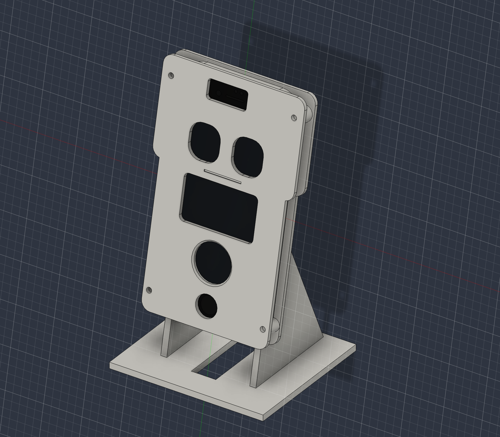

# 白PLA・2パーツケース V1

## 成果物

Fusion MCPで既存の `Phone Robot` に追加した初号機。単色の白PLAを想定し、可動機構、爪、磁石、別体の耳・腕は使わない。

- `Robot V1 - A Holder and Stand`：収納トレー、背面フランジ、2本の支え、台座を一体化した1ソリッド。
- `Robot V1 - B Front Cover`：角丸の頭と胴体、目・お腹・タッチ操作などの開口を持つ1ソリッド。
- 既存のiPhoneコンポーネント、形状、配置、SE3パラメータは変更していない。
- **実機装着、プリント、ケーブル接続、会話運転は未検証。量産・展示用の確定版ではない。**



### ファイル

| ファイル | 用途 |
|---|---|
| `cad/phone-robot-case-v1.f3d` | iPhone参照モデルを含む、履歴・スケッチ・パラメータ付きの編集用原本 |
| `cad/robot-v1-holder.step` / `cad/robot-v1-cover.step` | 各パーツのB-Rep形状。Fusionの作成履歴は含まない |
| `cad/robot-v1-holder.stl` / `cad/robot-v1-cover.stl` | mm単位、造形姿勢に変換済みのメッシュ |
| `cad/robot-v1-front.png` / `robot-v1-rear.png` / `robot-v1-perspective.png` | 確認用画像 |
| `cad/robot-v1-validation.json` | Fusionの形状・寸法変更テスト結果 |
| `cad/phone-robot-before-case.f3d` | ケースを追加する前のローカルバックアップ |

STLはパーツごとに造形用座標へ変換している。組み立て配置を確認するにはF3DまたはSTEPを使う。

## 基準と寸法

READMEの対象端末はSE第2世代だが、Fusion内の既存モデルは `iPhone SE 3 - Parametric Drawing Model`。ケースはこの既存モデルを参照して作成した。SE2実機への適合、保護フィルムの有無、実ケーブルの外形を別途確認する。

- 参照本体：67.27 × 138.44 × 7.31 mm。
- 参照表示領域：58.50 × 104.05 mm。
- 座標：iPhoneの外形中心をXY原点、右が+X、上が+Y。背面ガラスがZ=0、前面ガラスがZ=7.31 mm。
- ケース収納内寸：68.07 × 139.24 mm。上下左右の隙間は各0.4 mm。
- 背面パッド用隙間：0.5 mm。前面ガラスとカバー裏面の隙間：0.4 mm。
- 背板・側壁・前カバー：基本2.4 mm。
- 頭の幅92 mm、胴体の幅82 mm、前面カバーの高さ148 mm。
- **胴体幅は当初案78 mmから82 mmへ変更**。下側のM3ねじ穴と外周の余白を確保するため。
- ガラス直交方向の外装厚さ：約13.01 mm。台座・支えを除く。
- 台座：100 × 90 mm、厚さ4 mm。後傾12°。
- iPhone下端の背面側を机から35 mm持ち上げる。
- 組み立て時の全高：約177.2 mm。滑り止めの厚さは含まない。

### 開口

**画面の左上を原点にした左上位置・幅・高さ・中心位置、穴の種類と役割の詳細は、[開口部の寸法・配置仕様](robot-case-v1-openings.md) を参照。** Web画面の配置に使える換算式と2D配置図も記載している。

以下はiPhoneのXY座標での中心。単位mm。

| 部位 | 寸法 | 中心（X,Y） |
|---|---|---|
| 左右の目 | 20 × 22、角R8 | (±14,31) |
| お腹 | 48 × 28、角R3 | (0,-3) |
| 会話タッチ穴 | 画面側直径24 | (0,-35) |
| 額：前カメラ・受話口・センサー | 26 × 12、角R2 | (-3.5,62) |
| ホームボタンの保守アクセス | 直径14 | (0,-59.97) |
| 口 | 幅24 × 高さ1.2、深さ0.6の**溝** | (0,15.5) |
| 背面カメラ・マイク・フラッシュ | 26 × 18、角R2 | (-18,54.5) |
| 背面放熱・取り外し用 | 40 × 62、角R4 | (0,-7) |

会話タッチ穴の前縁に1 mmの45°面取りがあり、入口直径は26 mm、残る縁厚は1.4 mm。可動ボタンではなく、指がガラスに直接触れる穴。

ホームボタンの穴は保守用で、会話ボタンではない。前面の目・お腹・会話ボタンは表示領域内に収まっている。Safariの表示状態・CSSレイアウトとの一致は実機で確認する。

額と背面の開口は光学部品の形状を避けているが、カメラの画角やマイクの集音を保証するものではない。

## 構造・組み立て

1. ホルダー接触部に薄い保護パッドを貼る。背面は0.5 mmの隙間を用意しているが、パッドの実厚・圧縮量に合わせて調整する。
2. iPhoneを前側からトレーへ置く。強く押し込むスナップ式ではない。
3. Lightningケーブルを底部の開口へ通して接続する。
4. 前カバーを載せ、4本のM3ねじと背面側のナットで固定する。
5. 台座底面に滑り止めを貼る。

### 別途必要なもの

- M3ボルト4本、ナット4個。ねじ長さは18〜20 mm程度を候補に現物確認。
- 必要に応じて小径ワッシャー。下側は外周の余白が狭いため、過大なワッシャーを使わない。
- 薄い保護パッド、台座用滑り止め。

ねじ穴は直径3.4 mmの単純な貫通穴。ねじ山、インサート、ナットの回り止め、皿穴は設けていない。M3ナットは背面から工具で保持する。締付力はトレーの壁・ねじ受けとカバーの接触面で受け、ガラスを締め付けない。PLAをたわませるほど締めない。

### ケーブルと音孔

- 下端中央の幅54 mmを開放し、端子と左右の音孔列を避ける。
- iPhone下端は左右の角付近で受ける。
- 台座中央に幅16 mmの後方へ開いたケーブル溝。コネクタを閉じた小穴へ通す必要はない。
- ケーブルにiPhoneの重量を載せない。35 mmの持ち上げ量で十分かは、実プラグと無理のない曲げ方で確認する。

## Fusionでの編集

**通常はスクリプトを再実行せず、F3Dを開いて「修正 → パラメータを変更」を使う。** `RB_` がケースのパラメータ、`SE3_` が既存のiPhone参照パラメータ。

| 変更したい箇所 | 主なパラメータ |
|---|---|
| 目の形・間隔・高さ | `RB_EyeWidth`, `RB_EyeHeight`, `RB_EyeRadius`, `RB_EyeX`, `RB_EyeY` |
| お腹の穴 | `RB_BellyWidth`, `RB_BellyHeight`, `RB_BellyRadius`, `RB_BellyY` |
| 会話ボタン | `RB_TalkDiameter`, `RB_TalkY`, `RB_TouchBevel` |
| ケースのはまり具合 | `RB_Clearance`, `RB_BackGap`, `RB_FrontGap` |
| 頭と胴体の輪郭 | `RB_HeadWidth`, `RB_BodyWidth`, `RB_CaseHeight`, `RB_OuterRadius` |
| 台座・角度・高さ | `RB_BaseWidth`, `RB_BaseDepth`, `RB_BaseThickness`, `RB_Tilt`, `RB_Lift` |
| ケーブル溝 | `RB_CableWidth`, `RB_BottomOpening` |
| 放熱口 | `RB_VentWidth`, `RB_VentHeight` |

穴はそれぞれ独立した名前付きスケッチと切り取りフィーチャー。形そのものを変える場合は、ブラウザ内の各部品のスケッチを編集する。装飾口が不要なら `B09 Shallow mouth groove` を抑制できる。

34スケッチすべてを完全拘束している。変更範囲には以下の制限がある。

- 角Rは幅・高さの半分より小さくする。
- 面取りはカバー厚より小さくする。
- Y座標などは距離寸法と初期の符号で配置している。**負から正へ原点をまたぐ移動は、スケッチ側での再配置・拘束変更が必要。**
- 穴同士、ねじ、外周、表示領域に干渉するほどの変更は自動防止しない。
- 角度や外形を大きく変える場合、支えの接続と印刷性を再確認する。
- 実物のiPhone寸法を変えずに入れやすくする場合は、`SE3_`ではなく`RB_Clearance`を調整する。

### スクリプト

- `scripts/build_robot_case.py`：Fusionネイティブのパラメータ、スケッチ、押し出し・切り取りを構築。
- `scripts/validate_robot_case.py`：干渉、ソリッド数、拘束・フィーチャーの健康状態、寸法変更を検証。
- `scripts/export_robot_case.py`：F3D / STEP / 造形姿勢のSTL / 画像を出力。

Fusion MCPの `execute_code` 内で実行する例：

```python
path = '/Users/kato-mahiro/Projects/personal/iphone-robot/scripts/build_robot_case.py'
exec(compile(open(path, encoding='utf-8').read(), path, 'exec'))
result
```

これらはFusion APIが必要で、通常のターミナルからは実行しない。プロジェクトを移動した場合は各スクリプトの`ROOT`を変更する。

**buildの再実行は `Robot V1 - ` で始まる2コンポーネントを削除・再構築する。RBパラメータ値は保持するが、手作業による追加穴やスケッチの形状変更は保持しない。** 改造したF3Dは先に別名で保存する。

## 印刷の初期方針

まだスライサーでサポート・造形時間を検証していない。STLは試作用。

- 前カバーSTL：裏面をベッド側、表面を上に配置済み。平板なので、基本はサポートなしを想定。
- ホルダーSTL：台座の接地面をZ=0へ配置済み。**浮いたトレー下部などにサポートが必要。** スライサーで下面・橋渡し部分を確認する。
- 2パーツを優先したため、スタンドを別部品にしてサポートをなくす構造にはしていない。
- PLA、0.4 mmノズル・0.2 mm積層・3〜4周壁を初期候補にするが、機種に合わせて調整。
- ガラス周辺のバリ、穴径の縮み、初層の広がりを除去してから装着する。
- まず前カバーだけを印刷し、表示位置・指の届きやすさ・光学開口を確認する。

## 検証済みと未検証

### CAD上で確認済み

- 2パーツとも独立した1つのソリッド。
- 全34スケッチが完全拘束。
- 全35フィーチャーに警告・エラーなし。
- 現在の既存iPhoneモデルとケース2部品の体積干渉は0件。意図したケース同士の接触面は除外。
- 目幅22、目Y=33、お腹幅46、お腹Y=-2、タッチ穴直径26、タッチ穴Y=-34、収納隙間0.5、後傾15°、台座奥行き95、胴体幅84への個別変更で再計算成功。検証後は元の値へ戻している。
- STLのスケール、接地高さ、閉じたメッシュを別途検査。

### 実機で要確認

- SE2の外形・保護フィルム・パッド・造形公差と収納部の適合。
- 実ケーブルのプラグ、曲げ、抜き差しとねじ・ナットの工具アクセス。
- Safariの表示領域、画面の穴との一致、押し続ける操作。
- スピーカー音量・マイク集音、カメラ画角、照度センサーなど。
- 給電しながらの連続運転と温度。PLA外装を直射日光・高温に置かない。
- ボタン操作やケーブルを引いた場合の滑り・転倒。必要なら台座の拡大、机への固定や重りを追加する。現版に専用の重りポケットはない。

白い外観は付けているが、CADの物理材質密度はPLA・インフィルに合わせて校正していない。Fusion表示の質量・重心を、実機の安定性保証や使用フィラメント量として扱わない。
